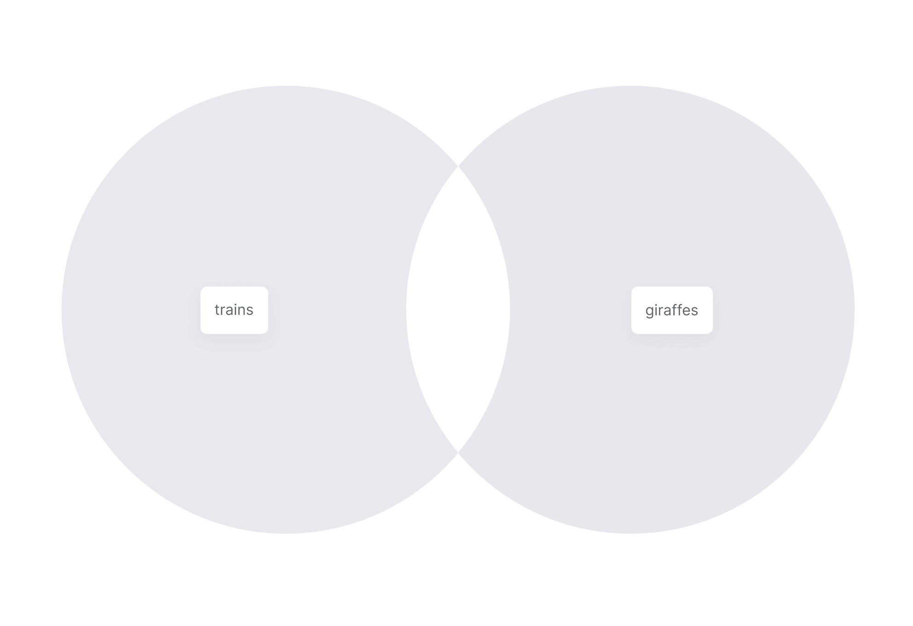
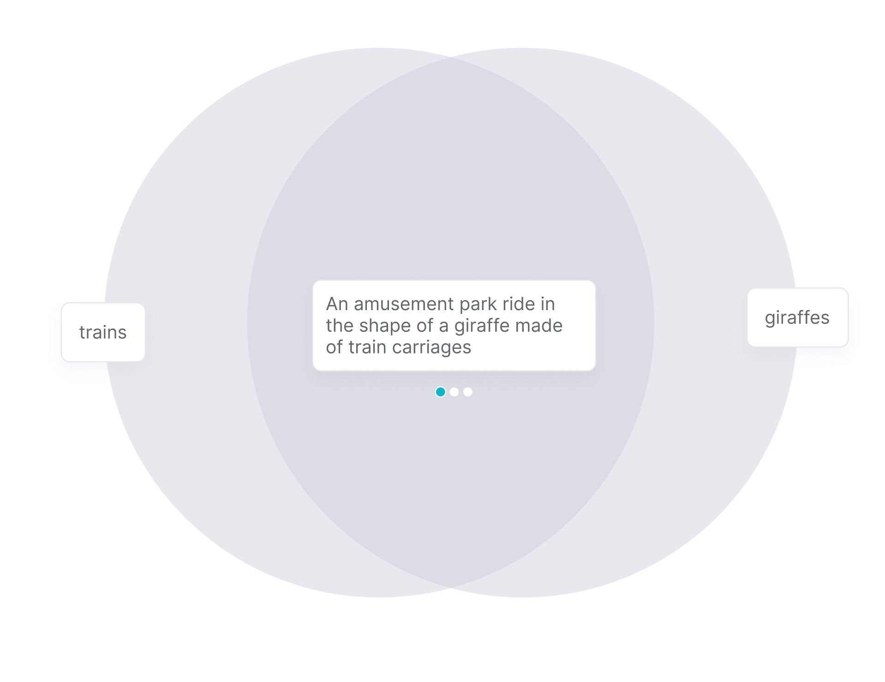
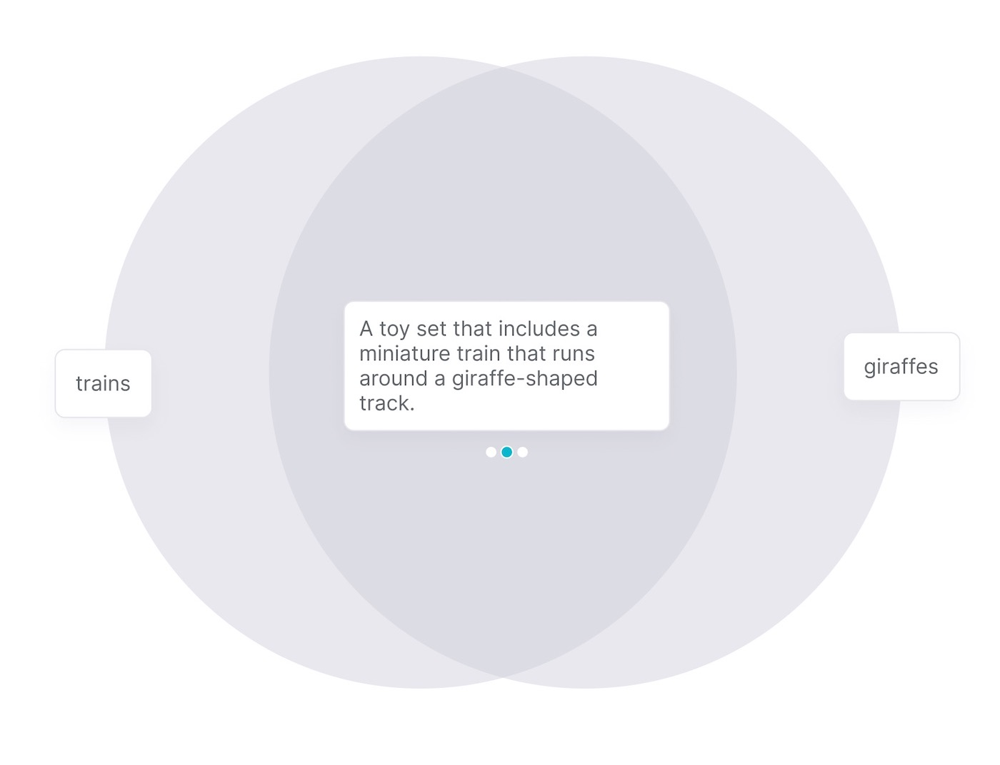
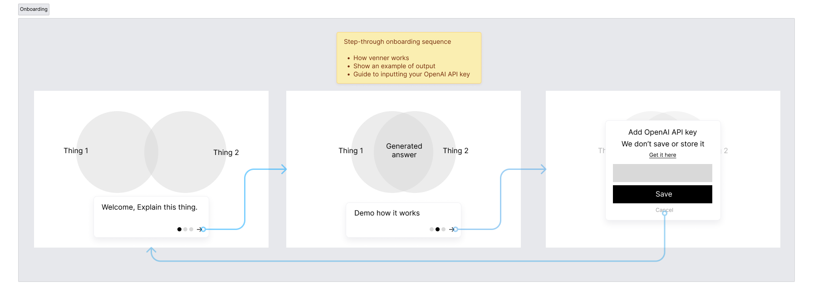
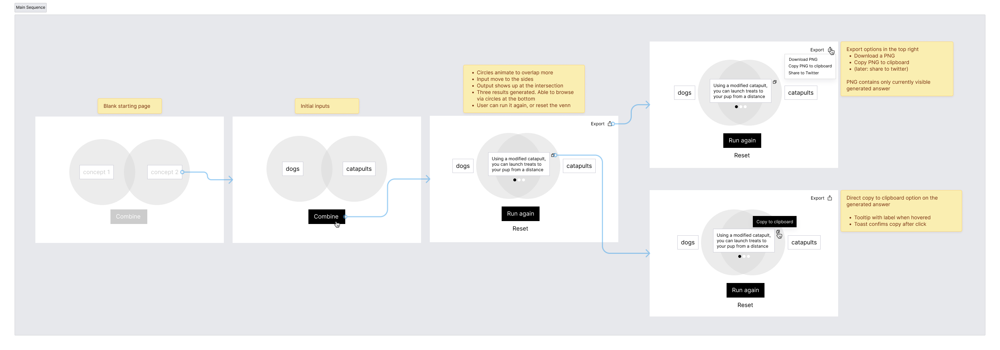

# Design Brief

[Final Designs](/design-process/final-designs.md)

## Concept

A venn diagram that combines two concepts or ideas for you. Using a generative language model, we give the user three++ possible ways to combine their initial concepts.

Uses OpenAI's GPT-3 to generate ideas.

Users can save generated results as text or PNGs.

## Initial Concept Sketches

Initial rough sketches

Two initial concepts added:

First result:

Second result:

## User Flows

Click on each image to see details and notes

Onboarding

Main flow

## Requirements

### Essential

Users should be able to:
- enter their OpenAI API key to make requests
  - make sure that API key isn't stored or exposed to 3rd parties
- enter two words or sentences. Max length 140 characters.
- click a button/area that triggers the combination action: sends a request to OpenAI
- see a loading animation while the request is resolving
- see the returned results
- be able to swipe/scroll/click through the three returned results
- be able to reset the whole venn to be blank
- be able to edit the existing inputs and re-run the generation

### Nice to have

- be able to generate more than three results
  - this could be re-running the whole generation, or clicking somewhere to generate a fourth or fifth result in addition to the first three
- copy generated results to the clipboard
- save a PNG of the final venn digram with inputs and generated results
- shared a generated PNG and link to Twitter
- animated rainbow gradient on venn circles – maybe a requirement 🌈

## Todos

- [x] Wireframe main user flow
- [x] Wireframe onboarding sequence
- [ ] Final designs that meet all the requirements
- [ ] Make an example dataset of prompts and good answers
- [ ] Research how we can accept OpenAI keys and use them for API requests without compromising user security
