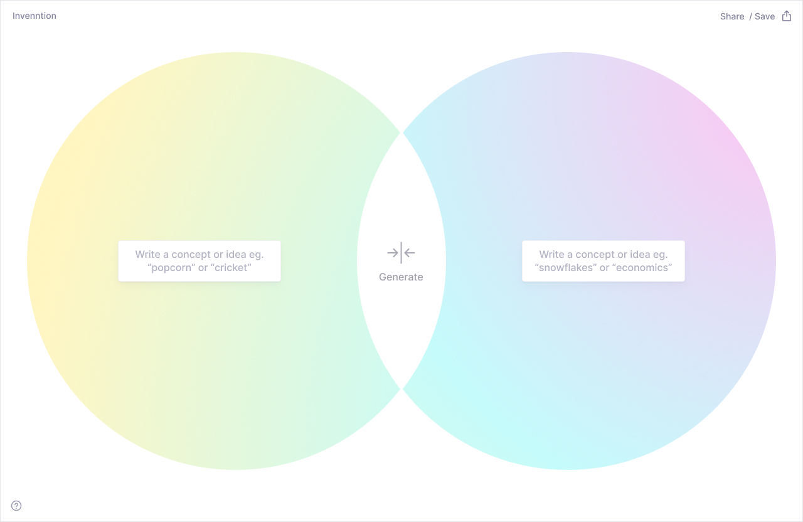
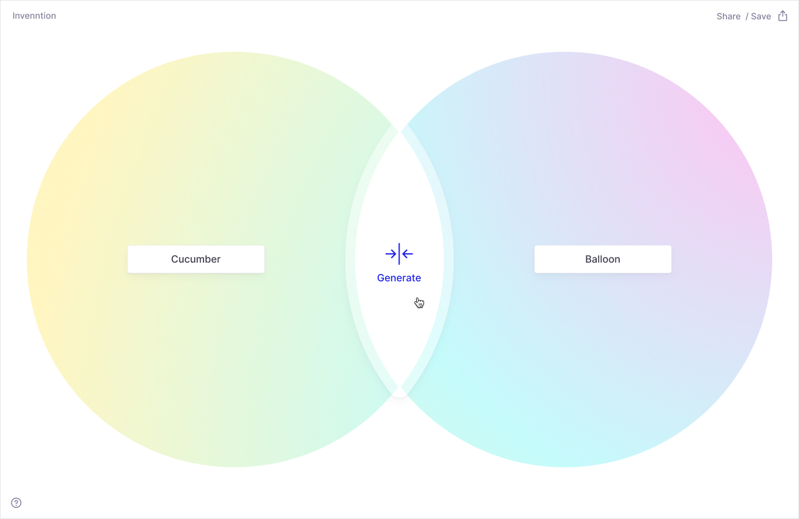
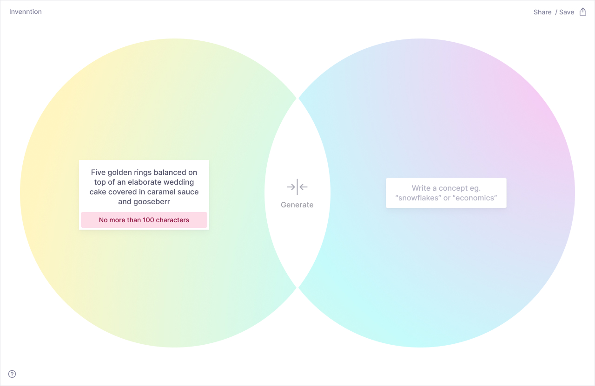
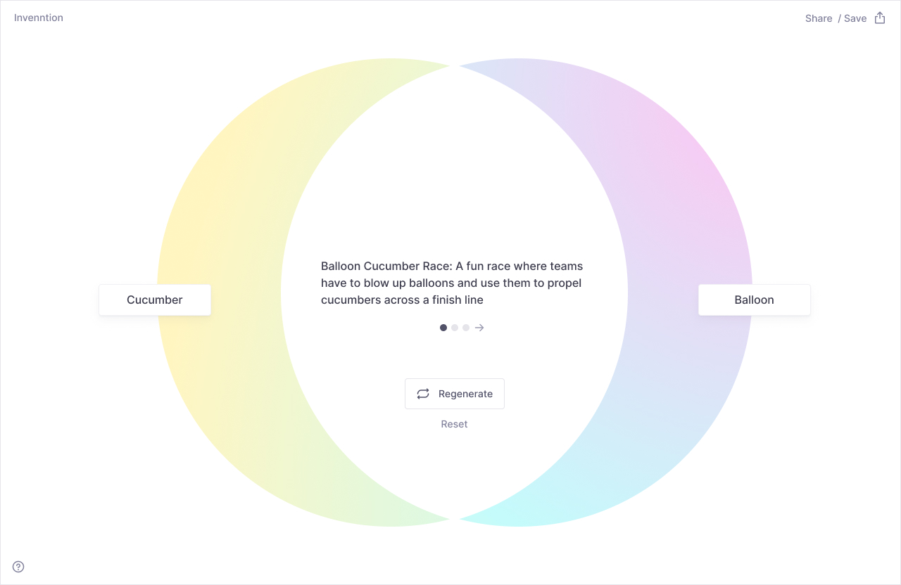
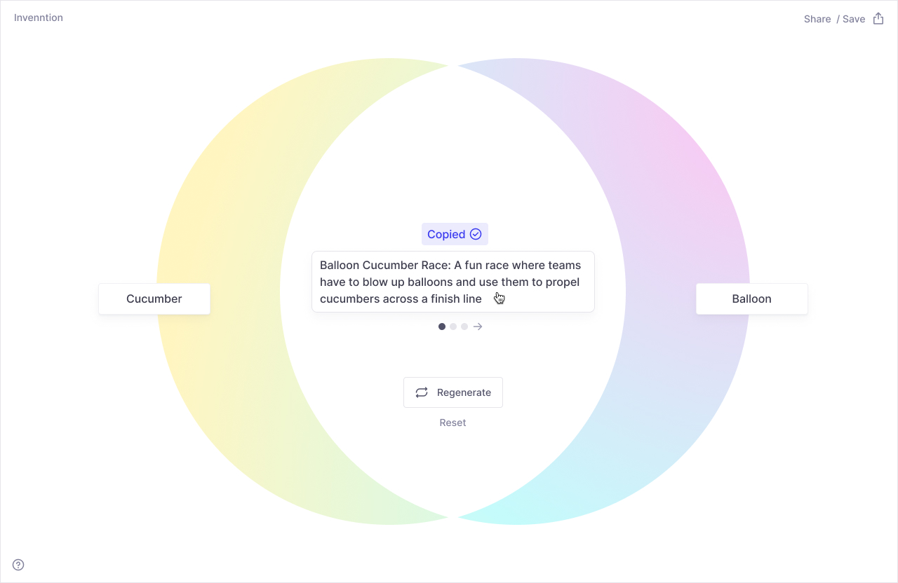

# Final Designs

 

Intial empty state before user enters inputs. Has suggested ideas for what kind of concepts to type in.

 

With user inputs for concepts

 

Hover state for generate button

 

Error message for inputs over 100 characters

 

With returned results

 

Hover state on the results – hint to click to copy to clipboard appears

 

After click on the results – shows confirmation message that result was copied to the clipboard

