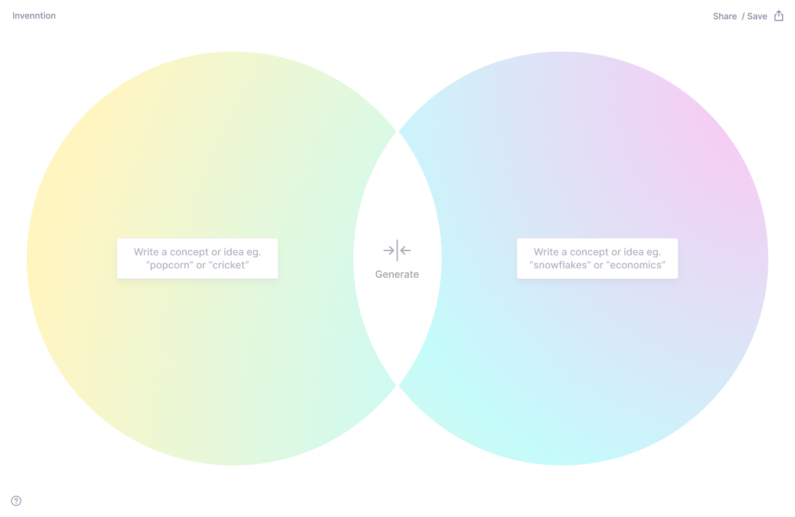
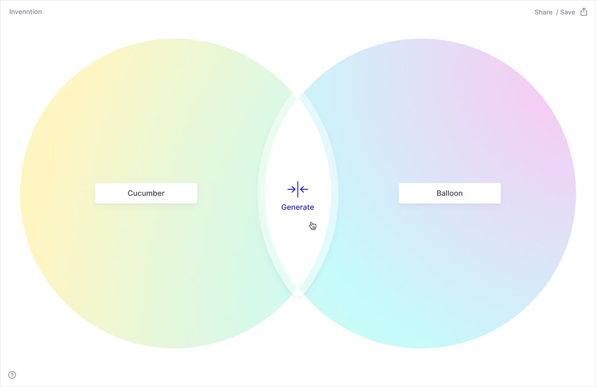
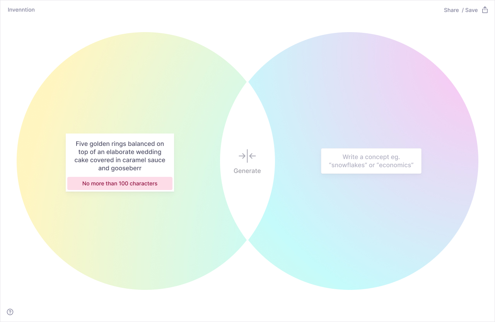
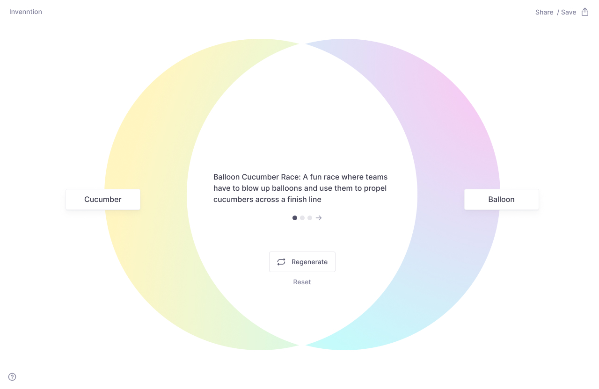
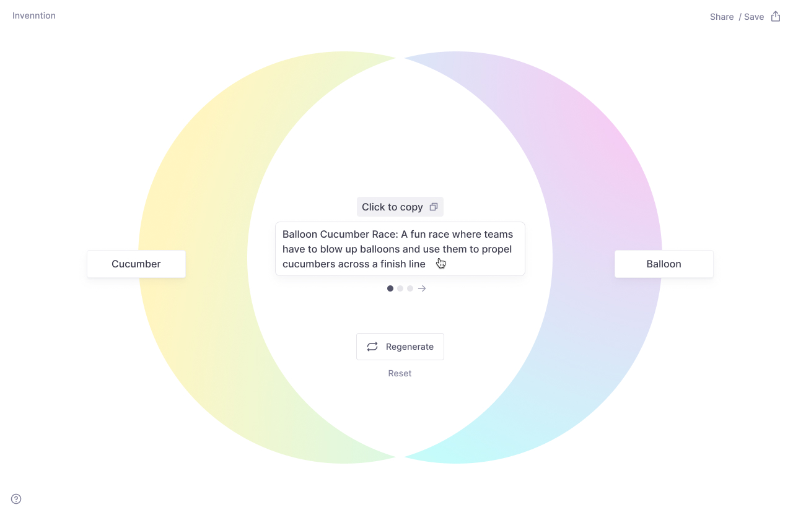
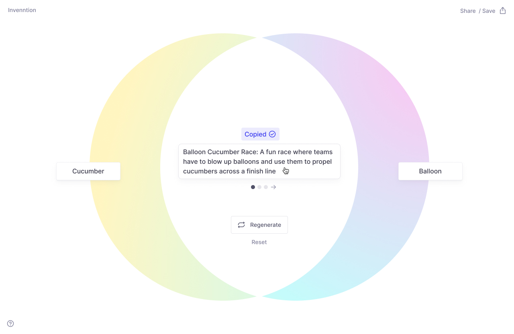
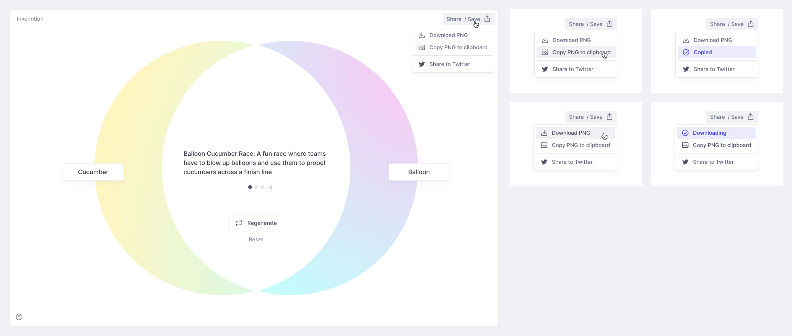
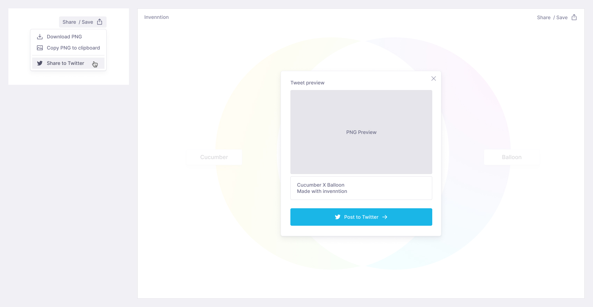

# Visual Designs

 

Intial empty state before user enters inputs. Has suggested ideas for what kind of concepts to type in.

 

With user inputs for concepts

 

Hover state for generate button

 

Error message for inputs over 100 characters

 

With returned results. Circles animate to move into an overlapped position. User has the option to regenerate the results, or reset the venn. The two inputs should still be editable.

 

Hover state on the results – hint to click to copy to clipboard appears

 

After click on the results – shows confirmation message that result was copied to the clipboard

 

Save/share menu interactions

 

Share to twitter modal

